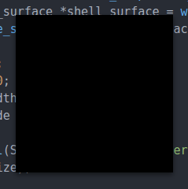

## 黑方块

《黑方块》是卡济米尔·马列维奇（Kazimir Malevich）的著名画作：


在本节的最后，我们将构建一个至少同样酷（而且黑得多）的东西：


### 表面（Surfaces）与缓冲区（Buffers）

在 **Wayland 协议** 中，你找不到 “window（窗口）” 这个词；取而代之的是 **“surface（表面）”**。仔细想想这其实很合理：屏幕上的那些矩形东西和墙上的窗户（让你从里面看到外面）有什么共同点呢？不过，我们可以很容易地把 “窗口” 想象成 “表面” —— 就像一张张纸片一样，漂浮在桌面壁纸之上。

但在 Wayland 里，表面并不仅限于桌面窗口。还有其他“漂浮的东西”也是表面：比如菜单等弹出窗口（popup）、鼠标指针（cursor/pointer）、拖拽时的图标（drag’n’drop item）等等。表面的具体身份（比如是窗口、光标还是拖拽图标）由它的 **角色（role）** 决定，这部分我们稍后再讲。但无论角色如何，所有表面都有一些共同的功能：它们都可以显示并更新内容，还可以改变自身的大小。

这里需要理解的一个重点是：**你并不是直接在表面上绘制**。正确的方式是先把内容渲染到一个 **缓冲区（buffer）**，然后把缓冲区附加到表面上。如果你需要更新内容或重新绘制，那么就渲染一张新的图像到另一个缓冲区（有时也可以重用原来的），再把这个新的缓冲区附加到表面上。每一帧画面都需要重复这些步骤。

这种方式相比直接在表面上绘制有几个优势：

+ 你可以提前或并行渲染帧，然后在恰当的时机展示它们。
+ 更重要的是，在 Wayland 中，每一帧都是完整的：**只有在一帧完全渲染完成后，才会将缓冲区附加到表面**。因此不会出现屏幕撕裂（screen tearing）的现象。

要创建一个表面，可以使用 `wl_compositor.create_surface` 请求；要附加缓冲区，可以用 `wl_surface.attach`，然后调用 `wl_surface.commit`：

```c
struct wl_compositor *compositor = ...;
struct wl_surface *surface = wl_compositor_create_surface(compositor);
struct wl_buffer *buffer = ...;
wl_surface_attach(surface, buffer, 0, 0);
wl_surface_commit(surface);
```

这里我们使用了之前从注册表（registry）获取的 **compositor 全局对象**。  
至于如何创建缓冲区，我们马上会讲。但在此之前，需要指出的是：**仅仅创建一个表面并不足以让它显示在屏幕上；必须先给它分配一个角色（role）**。这一点我们稍后会详细解释。

### 分配缓冲区（Allocating a buffer）

Wayland 被设计成支持多种格式和不同来源的缓冲区。仅使用核心 Wayland 协议时，你唯一能创建的缓冲区是 共享内存池（shared memory pool） 中的缓冲区。但通过扩展可以增加新的缓冲区类型：例如 wl_drm 扩展允许在 GPU 显存 中分配缓冲区。

所以，这里我们先用共享内存池来演示。其核心思想是：与其把完整的缓冲区内容通过 socket 发送（这样既昂贵又缓慢），不如在客户端和合成器之间建立一个共享内存池。这样一来，只需要通过 socket 传递缓冲区在池中的位置即可。

第一步是在客户端地址空间中映射一块内存。我这里使用 Linux 的 `memfd_create` 系统调用，如果不能用它，创建一个临时文件也同样可行：

```c
#include <syscall.h>
#include <unistd.h>
#include <sys/mman.h>

int size = 200 * 200 * 4;  // bytes, explained below
// open an anonymous file and write some zero bytes to it
int fd = syscall(SYS_memfd_create, "buffer", 0);
ftruncate(fd, size);

// map it to the memory
unsigned char *data = mmap(NULL, size, PROT_READ | PROT_WRITE, MAP_SHARED, fd, 0);
```

#接下来，我们需要告诉合成器，它也应该把同一个文件映射到它的内存中，从而创建一个共享内存池。这可以通过 `wl_shm.create_pool` 请求实现：

```c
struct wl_shm *shm = ...;
struct wl_shm_pool *pool = wl_shm_create_pool(shm, fd, size);
```

文件描述符和大小会通过 socket 发送给合成器，这样它就可以执行类似的 mmap 调用，从而访问同一块内存池。

注意：共享内存池本身并不是缓冲区。你可以在一个内存池中分配多个缓冲区。所谓分配缓冲区，就是告诉合成器：从某个偏移位置开始，给定大小和 stride（步幅）的这段内存代表一张特定格式的图像。这是通过 `wl_shm_pool.create_buffer` 请求实现的：

```c
#include <syscall.h>
#include <unistd.h>
#include <sys/mman.h>

int width = 200;
int height = 200;
int stride = width * 4;
int size = stride * height;  // 字节数

// 打开一个匿名文件，并写入一些零字节
int fd = syscall(SYS_memfd_create, "buffer", 0);
ftruncate(fd, size);

// 将其映射到内存
unsigned char *data = mmap(NULL, size, PROT_READ | PROT_WRITE, MAP_SHARED, fd, 0);

// 将其转换为共享内存池
struct wl_shm *shm = ...;
struct wl_shm_pool *pool = wl_shm_create_pool(shm, fd, size);

// 在池中分配缓冲区
struct wl_buffer *buffer = wl_shm_pool_create_buffer(pool,
    0, width, height, stride, WL_SHM_FORMAT_XRGB8888);
```

在我们的最简单例子中，我们分配了一个占据整个池子的缓冲区：具体做法是传入偏移量 0，并且之前把池子的大小设置成和缓冲区大小相同。在实际程序中，你可能需要更高级的内存分配策略，在同一个池子中动态创建多个缓冲区，而不是频繁地映射和解除映射新的文件。

下面是完整的分配缓冲区的示例代码：

```c
#include <syscall.h>
#include <unistd.h>
#include <sys/mman.h>

#include <stdio.h>
#include <string.h>
#include <wayland-client.h>

struct wl_compositor *compositor;
struct wl_shm *shm;
struct wl_shell *shell;

void registry_global_handler
(
    void *data,
    struct wl_registry *registry,
    uint32_t name,
    const char *interface,
    uint32_t version
) {
    if (strcmp(interface, "wl_compositor") == 0) {
        compositor = wl_registry_bind(registry, name,
            &wl_compositor_interface, 3);
    } else if (strcmp(interface, "wl_shm") == 0) {
        shm = wl_registry_bind(registry, name,
            &wl_shm_interface, 1);
    }
}

void registry_global_remove_handler
(
    void *data,
    struct wl_registry *registry,
    uint32_t name
) {}

const struct wl_registry_listener registry_listener = {
    .global = registry_global_handler,
    .global_remove = registry_global_remove_handler
};

int main(void)
{
    struct wl_display *display = wl_display_connect(NULL);
    struct wl_registry *registry = wl_display_get_registry(display);
    wl_registry_add_listener(registry, &registry_listener, NULL);

    // 等待“初始”的全局对象出现
    wl_display_roundtrip(display);

    // 我们需要的对象应该已经就绪！
    if (compositor && shm) {
        printf("Got them all!\n");
    } else {
        printf("Some required globals unavailable\n");
        return 1;
    }

    int width = 200;
    int height = 200;
    int stride = width * 4;
    int size = stride * height;  // 字节数

    // 打开匿名文件并写入零字节
    int fd = syscall(SYS_memfd_create, "buffer", 0);
    ftruncate(fd, size);

    // 映射到内存
    unsigned char *data = mmap(NULL, size, PROT_READ | PROT_WRITE, MAP_SHARED, fd, 0);

    // 创建共享内存池
    struct wl_shm_pool *pool = wl_shm_create_pool(shm, fd, size);

    // 在池中分配缓冲区
    struct wl_buffer *buffer = wl_shm_pool_create_buffer(pool,
        0, width, height, stride, WL_SHM_FORMAT_XRGB8888);

    while (1) {
        wl_display_dispatch(display);
    }
}
```

`code/ch03/sample3-1`

如果我们现在要渲染一些东西，只需要往 data 指针指向的内存中写入内容，因为在我们的例子里，缓冲区就从池子的开头开始。

不过，如果只是显示一个黑色方块，我们甚至什么都不需要做：因为在 XRGB8888 格式下，四个零字节 (0, 0, 0, 0) 就表示一个黑色像素（第一个字节会被忽略，后面三个是 RGB 分量）。所以我们的缓冲区已经被填充为一个 200×200 的黑色方块。

事实上，我们甚至不需要调用 mmap；只要拿到文件描述符并传递给合成器就足够了。

### Shell 表面 (Shell Surface)

为了让我们的 surface（表面）能被显示在屏幕上，我们需要给它指定一个角色（role）。在 Wayland 中，并没有一个统一的机制给 surface 指定角色；每一种角色（cursor、popup、toplevel 窗口等）都有自己特定的机制。

举个例子：如果我们想让一个 surface 成为鼠标光标，就可以用 `wl_pointer.set_cursor` 请求，把那个 surface 作为参数传入，从而给这个 surface 赋予 “cursor” 的角色。

而对于像桌面窗口那样的角色，就要稍微复杂一些，因为这种角色通常需要额外的功能支持（例如响应重设大小、最大化、最小化等）。

在 Wayland 核心协议中，`wl_shell` 和 `wl_shell_surface` 已经被标记为废弃（deprecated），被更强大、更标准的 **xdg-shell** 协议扩展所替代，新的 compositor（GNOME、KDE、Weston 9+）基本不会再提供它。所以下面使用 `xdg-shell` 进行说明。

在这个教程中，我们要把 surface 装饰成桌面风格的窗口（toplevel 窗口），所用的角色来自 `xdg-shell` 协议扩展。

你可以这样理解这两者的关系：

* 一种理解是：xdg_surface 就像是 surface 的一个“子类”，它在 surface 的基础上增加了窗口管理相关的功能。
* 另一种理解是：surface 和 xdg_surface 是两个不同的对象，但它们相互关联：surface 负责内容显示（像素缓冲、绘制等），而 xdg_surface 负责窗口管理（位置、尺寸、关闭、全屏、最小化等）。

在将 buffer（显示内容）附加给 surface 之前，我们通常要先为它绑定角色：

```c
struct xdg_wm_base *xdg_wm_base = ...;  // 从 registry 获取的全局对象
struct xdg_surface *xdg_surface =
    xdg_wm_base_get_xdg_surface(xdg_wm_base, surface);

struct xdg_toplevel *toplevel = xdg_surface_get_toplevel(xdg_surface);
xdg_toplevel_set_title(toplevel, "My App");
```

这几行代码的意义：

* `xdg_wm_base_get_xdg_surface(xdg_wm_base, surface)`：通过 `xdg_wm_base` 请求一个 `xdg_surface`，并把它和已有的 `surface` 绑定，赋予它窗口的角色。

* `xdg_surface_get_toplevel(xdg_surface)`：把这个 `xdg_surface` 提升为 **toplevel** 类型，也就是普通桌面窗口（可以被用户移动、调整大小、最大化/最小化等）。

* `xdg_toplevel_set_title(toplevel, "My App")`：设置窗口的标题，显示在窗口装饰栏上。

使用 `xdg_shell` 的流程如下：

1. **从注册表 (`wl_registry`) 获取全局的 `xdg_wm_base` 对象**

   * 在注册表监听函数里，检查 `interface == "xdg_wm_base"`，然后 `wl_registry_bind`。
   * `xdg_wm_base` 就是 `wl_shell` 的替代，它负责创建 `xdg_surface`。

2. **使用 `xdg_wm_base` 创建 `xdg_surface`**

   * 先用 `wl_compositor_create_surface()` 创建一个 `wl_surface`。
   * 然后调用 `xdg_wm_base_get_xdg_surface(wm_base, wl_surface)` 得到 `xdg_surface`。
   * 这一步相当于 `wl_shell_get_shell_surface()`，只是换成了 `xdg_surface`。

3. **将 `xdg_surface` 提升为顶层窗口 (`xdg_toplevel`)**

   * 使用 `xdg_surface_get_toplevel(xdg_surface)` 得到 `xdg_toplevel`。
   * 这是 `xdg_shell` 里声明“这是一个普通应用窗口”的方式，相当于 `wl_shell_surface_set_toplevel()`。
   * 可以在这里调用 `xdg_toplevel_set_title()` 设置窗口标题。

4. **监听并响应事件**

   * `xdg_wm_base` 会发送 **ping 事件**，你需要回复 `xdg_wm_base_pong()`。
   * `xdg_toplevel` 还会有一些事件，比如 `configure`（调整大小）、`close`（窗口被关闭）。
   * 至少要处理 `xdg_surface.configure`，否则窗口不会显示出来（需要 `ack_configure`）。

注意：

使用 `xdg_shell` 需要 xdg-shell-client-protocol.h 和 xdg-shell-protocol.c 两个文件，需要先用 wayland-protocols 里的 xdg-shell.xml 生成：

```
$ sudo apt install wayland-protocols
$ wayland-scanner client-header \
  /usr/share/wayland-protocols/stable/xdg-shell/xdg-shell.xml \
  xdg-shell-client-protocol.h
$ wayland-scanner private-code \
  /usr/share/wayland-protocols/stable/xdg-shell/xdg-shell.xml \
  xdg-shell-protocol.c
```

### 完整代码（The complete code）

到这里，我们已经具备在屏幕上显示一个黑色方块的所有必要步骤了！下面是完整的代码：

```c
#include <stdio.h>
#include <string.h>
#include <stdlib.h>

#include <syscall.h>
#include <unistd.h>
#include <sys/mman.h>

#include <wayland-client.h>
#include "xdg-shell-client-protocol.h"  // 需要用 wayland-scanner 生成

struct wl_compositor *compositor = NULL;
struct wl_shm *shm = NULL;
struct xdg_wm_base *wm_base = NULL;

struct wl_surface *surface = NULL;
struct wl_buffer *buffer = NULL;

// 函数前向声明
static void create_and_attach_buffer(int width, int height);

// xdg_surface configure
static void xdg_surface_configure(void *data, struct xdg_surface *xdg_surface, uint32_t serial) {
    printf("Received xdg_surface.configure event\n"); // 调试输出
    // 必须 ack configure
    xdg_surface_ack_configure(xdg_surface, serial);

    // 在这里创建并附加 buffer，然后 commit
    // 理想情况下，应该根据 configure 事件传递的尺寸来创建 buffer
    create_and_attach_buffer(200, 200);
    wl_surface_attach(surface, buffer, 0, 0);
    wl_surface_commit(surface);
}

// xdg_toplevel configure (可选，但推荐实现)
static void xdg_toplevel_configure(void *data, struct xdg_toplevel *xdg_toplevel, int32_t width, int32_t height, struct wl_array *states) {
    // 合成器可能会在这里建议窗口大小
    // 如果 width 和 height 不为0，可以根据这个大小重新创建 buffer
}

// xdg_toplevel close
static void xdg_toplevel_close(void *data, struct xdg_toplevel *xdg_toplevel) {
    // 用户点击了关闭按钮
    // 在这里退出主循环
    exit(0);
}

static const struct xdg_surface_listener xdg_surface_listener = {
    .configure = xdg_surface_configure
};

// 添加 toplevel listener 来处理关闭事件
static const struct xdg_toplevel_listener xdg_toplevel_listener = {
    .configure = xdg_toplevel_configure,
    .close = xdg_toplevel_close,
};

// 处理 wm_base 的 ping
static void xdg_wm_base_ping(void *data,
    struct xdg_wm_base *xdg_wm_base, uint32_t serial)
{
    xdg_wm_base_pong(xdg_wm_base, serial);
}

static const struct xdg_wm_base_listener wm_base_listener = {
    .ping = xdg_wm_base_ping
};

static void registry_global_handler(
    void *data,
    struct wl_registry *registry,
    uint32_t name,
    const char *interface,
    uint32_t version
) {
    if (strcmp(interface, "wl_compositor") == 0) {
        compositor = wl_registry_bind(registry, name,
            &wl_compositor_interface, 3);
    } else if (strcmp(interface, "wl_shm") == 0) {
        shm = wl_registry_bind(registry, name,
            &wl_shm_interface, 1);
    } else if (strcmp(interface, "xdg_wm_base") == 0) {
        wm_base = wl_registry_bind(registry, name,
            &xdg_wm_base_interface, 1);
    }
}

static void registry_global_remove_handler(
    void *data,
    struct wl_registry *registry,
    uint32_t name
) {
    // 忽略
}

static const struct wl_registry_listener registry_listener = {
    .global = registry_global_handler,
    .global_remove = registry_global_remove_handler
};

// 将 Buffer 创建逻辑封装成一个函数
static void create_and_attach_buffer(int width, int height) {
    if (buffer) {
        // 如果 buffer 已存在，先销毁（在窗口大小调整时需要）
        wl_buffer_destroy(buffer);
    }

    int stride = width * 4;
    int size = stride * height;

    // 创建共享内存 buffer
    int fd = syscall(SYS_memfd_create, "buffer", 0);
    if (fd == -1) {
        perror("memfd_create failed");
        exit(1);
    }
    ftruncate(fd, size);

    // 将共享内存映射到进程地址空间
    unsigned char *data = mmap(NULL, size, PROT_READ | PROT_WRITE, MAP_SHARED, fd, 0);
    if (data == MAP_FAILED) {
        perror("mmap failed");
        close(fd);
        exit(1);
    }

    // 填充黑色背景 (XRGB8888, Alpha被忽略，所以0x00000000就是黑色)
    memset(data, 0x00, size);
    munmap(data, size); // 解除映射，因为 wl_shm_pool 已经接管

    struct wl_shm_pool *pool = wl_shm_create_pool(shm, fd, size);
    buffer = wl_shm_pool_create_buffer(pool,
        0, width, height, stride, WL_SHM_FORMAT_XRGB8888);

    // pool在创建buffer后就可以销毁了
    wl_shm_pool_destroy(pool);
    // fd在创建pool后就可以关闭了
    close(fd);
}

int main(void)
{
    struct wl_display *display = wl_display_connect(NULL);
    if (!display) {
        fprintf(stderr, "无法连接 Wayland 显示服务器\n");
        return -1;
    }

    struct wl_registry *registry = wl_display_get_registry(display);
    wl_registry_add_listener(registry, &registry_listener, NULL);

    wl_display_roundtrip(display);

    if (!compositor || !shm || !wm_base) {
        fprintf(stderr, "缺少必要的全局对象 (compositor/shm/wm_base)\n");
        return -1;
    }

    xdg_wm_base_add_listener(wm_base, &wm_base_listener, NULL);

    surface = wl_compositor_create_surface(compositor);

    struct xdg_surface *xdg_surface = xdg_wm_base_get_xdg_surface(wm_base, surface);
    struct xdg_toplevel *toplevel = xdg_surface_get_toplevel(xdg_surface);

    xdg_toplevel_set_title(toplevel, "黑色窗口");

    xdg_surface_add_listener(xdg_surface, &xdg_surface_listener, NULL);
    // *** 关键修改 2: 添加 toplevel listener ***
    // 这样才能响应关闭按钮等事件
    xdg_toplevel_add_listener(toplevel, &xdg_toplevel_listener, NULL);


    // *** 关键修改 1: 发送初始化的 commit ***
    // 这次 commit 告诉合成器，我们已经完成了初始设置，请发送 configure 事件
    wl_surface_commit(surface);
    printf("Initial wl_surface_commit sent\n"); // 调试输出


    // 注释掉在这里创建 buffer 的代码，将其移到 configure 回调中
    /*
    int width = 200;
    int height = 200;
    create_and_attach_buffer(width, height);
    */

    while (wl_display_dispatch(display) != -1) {
        // 主循环等待事件
    }

    // 清理资源 (虽然在这个例子中，程序退出时会自动清理)
    if (buffer) wl_buffer_destroy(buffer);
    if (toplevel) xdg_toplevel_destroy(toplevel);
    if (xdg_surface) xdg_surface_destroy(xdg_surface);
    if (surface) wl_surface_destroy(surface);
    if (display) wl_display_disconnect(display);


    return 0;
}
```

`code/ch03/sample3-2`

现在，如果你像平常一样编译并运行它：

```bash
$ gcc main.c xdg-shell-protocol.c -l wayland-client -o runme
$ ./runme
```

你会看到屏幕上弹出一个黑色方块：



它没有窗口边框，因此你无法通过拖拽来移动它，不过你的 Wayland 合成器可能会提供一些额外的方法来管理这些“不愿被管理”的窗口。比如，在 GNOME 中，当你按住 Super 键时，可以拖动任何窗口。除此之外，它的行为应该和普通窗口一样，例如，它应该会出现在应用程序切换器中，比如 GNOME Shell 的概览界面，或者通过按 Alt-Tab 调出的切换器中。

我们也没有实现关闭窗口的功能，程序也没有响应 ping 事件，因此你的合成器可能会在一段时间后认为该窗口没有响应，并提示你“强制退出”（也就是杀掉进程）。当然，你也可以直接用 Ctrl-C 手动终止进程。
