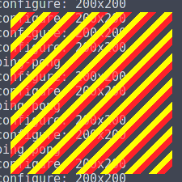

## 绘制

在 Wayland 中，所有绘制操作都是在客户端完成的。你需要先在缓冲区中渲染内容，然后将缓冲区附加到表面上。绘制操作不会通过套接字发送出去。因此，Wayland 本身并不提供任何渲染功能或 API。

这给了你在实现渲染时最大的自由度。大多数情况下，你会使用专门的图形库，例如 Cairo（我们将在下一节中使用它），但为了不让事情复杂化，这里我们先做一些手动绘制。

话说回来，让我们开始绘制吧！

首先，将 wl_shm_pool::create_buffer 调用中的格式从 WL_SHM_FORMAT_XRGB8888 改为 WL_SHM_FORMAT_ARGB8888（注意用 A 替换了 X）：

```c
// allocate the buffer in that pool
struct wl_buffer *buffer = wl_shm_pool_create_buffer(pool,
    0, width, height, stride, WL_SHM_FORMAT_ARGB8888);
```

其实这一步并非必须，因为我们暂时还没用到透明度，但如果使用 XRGB，GNOME Shell 似乎会渲染出错误的颜色。

现在我们可以直接用一些颜色填充缓冲区了：

```c
for (int x = 0; x < width; x++) {
    for (int y = 0; y < height; y++) {

        struct pixel {
            // little-endian ARGB
            unsigned char blue;
            unsigned char green;
            unsigned char red;
            unsigned char alpha;
        } *px = (struct pixel *) (data + y * stride + x * 4);

        // yellow
        px->alpha = 255;
        px->red = 255;
        px->green = 255;
        px->blue = 0;
    }
}
```

这就是我们所需的全部内容。现在编译并运行它：

```bash
$ make
$ ./runme1
```


太棒了！现在，让我们添加一个图案、更多颜色以及一些透明度。

```c
// draw a stripes pattern
if ((x + y) % 30 < 10) {
    // transparent
    px->alpha = 0;
} else if ((x + y) % 30 < 20) {
    // yellow
    px->alpha = 255;
    px->red = 255;
    px->green = 255;
    px->blue = 0;
} else {
    // semitransparent red
    px->alpha = 128;
    px->red = 255;
    px->green = 0;
    px->blue = 0;
}
```



在最后一个示例中，让我们画一个十字：

```c
// draw a cross
if ((80 < x && x < 120) || (80 < y && y < 120)) {
    // gradient from blue at the top to white at the bottom
    px->alpha = 255;
    px->red = (double) y / height * 255;
    px->green = px->red;
    px->blue = 255;
} else {
    // transparent
    px->alpha = 0;
}
```


