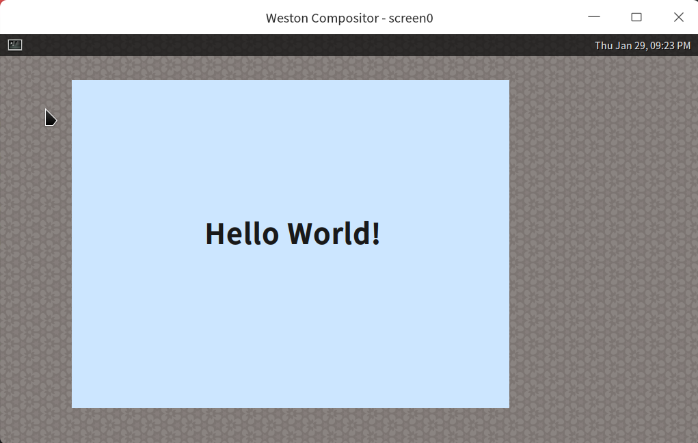

## 窗口装饰

到目前为止，咱们开发的应用程序不像是一个标准的窗口应用程序，它没有边框，没有标题，也没有最大化、最小化和关闭按钮。

这是由于在 Wayland 体系下，窗口的“装饰”（即边框、标题栏、按钮等）有两种方式：

1. 服务端装饰（SSD, Server Side Decoration）

* 由合成器自动为顶层窗口（xdg_toplevel）添加装饰。
* 但有些合成器默认不加装饰。

2. 客户端装饰（CSD, Client Side Decoration）

* 由应用程序自己绘制装饰（如 GTK、Chrome 浏览器等）。

但这就造成一种尴尬的情形，客户端和服务器端都以为对方会绘制窗口装饰，结果都没有绘制。

为了解决这种矛盾，人们就想出了一个新方法，干脆协商一下吧，商量到底谁来绘制这个窗口装饰。于是 Wayland 定义了一个专门的扩展协议，叫 xdg-decoration（全名 xdg-decoration-unstable-v1），用于协商窗口装饰的方式。如果合成器支持该协议，客户端可以请求服务端为窗口添加装饰（SSD），否则需要自己绘制（CSD）。

### 典型流程

* 客户端通过 wl_registry 获取 zxdg_decoration_manager_v1。

```c
static void registry_handle_global(void *data, struct wl_registry *registry, uint32_t name,
                                   const char *interface, uint32_t version) {
    struct state *state = data;

    ...
    
    if (strcmp(interface, zxdg_decoration_manager_v1_interface.name) == 0) {
        state->decoration_manager = wl_registry_bind(registry, name, &zxdg_decoration_manager_v1_interface, 1);
    }
}
```

* 用 zxdg_decoration_manager_v1 为 xdg_toplevel 创建 decoration 对象，并设置模式

```c
    if (state.decoration_manager) {
        printf("Decoration manager found. Negotiating...\n");
        // 为我们的窗口获取一个装饰对象
        state.toplevel_decoration = zxdg_decoration_manager_v1_get_toplevel_decoration(
            state.decoration_manager, state.xdg_toplevel);
        // 添加监听器以接收合成器的决定
        zxdg_toplevel_decoration_v1_add_listener(
            state.toplevel_decoration, &decoration_listener, &state);
        // 优先使用服务器端装饰
        zxdg_toplevel_decoration_v1_set_mode(
            state.toplevel_decoration, ZXDG_TOPLEVEL_DECORATION_V1_MODE_SERVER_SIDE);
    }
```

* 合成器响应，决定是否提供装饰。(注：在 treeland 下该回调并不会触发，在前面设置什么模式，合成器就使用什么模式，所以这个监听并不是必须的)

```c
// -- xdg_toplevel_decoration 的事件监听器
static void decoration_handle_configure(void *data,
                                        struct zxdg_toplevel_decoration_v1 *decoration,
                                        uint32_t mode)
{
    // 这是协商的核心！合成器通过这个事件告诉我们它最终决定的装饰模式。
    printf("==> Compositor negotiated decoration mode: ");
    switch (mode) {
        case ZXDG_TOPLEVEL_DECORATION_V1_MODE_CLIENT_SIDE:
            printf("Client-Side (we must draw our own!)\n");
            break;
        case ZXDG_TOPLEVEL_DECORATION_V1_MODE_SERVER_SIDE:
            printf("Server-Side (compositor will draw for us!)\n");
            break;
        default:
            printf("Unknown\n");
            break;
    }
}
```

### 运行效果

完整代码请参考 `code/ch04/sample4-5` 下的代码，在 treeland 下执行效果如下：


但是如果合成器是 weston 或者在 Ubuntu 24.04 下运行，仍然没有窗口装饰：



而且还有如下输出：

```
Decoration manager not found. Cannot negotiate decorations.
```

