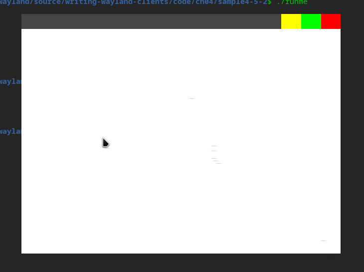

## 窗口装饰

到目前为止，咱们开发的应用程序不像是一个标准的窗口应用程序，它没有边框，没有标题，也没有最大化、最小化和关闭按钮。

这是由于在 Wayland 体系下，窗口的“装饰”（即边框、标题栏、按钮等）有两种方式：

1. 服务端装饰（SSD, Server Side Decoration）

* 由合成器自动为顶层窗口（xdg_toplevel）添加装饰。
* 但有些合成器默认不加装饰。

2. 客户端装饰（CSD, Client Side Decoration）

* 由应用程序自己绘制装饰（如 GTK、Chrome 浏览器等）。

但这就造成一种尴尬的情形，客户端和服务器端都以为对方会绘制窗口装饰，结果都没有绘制。

为了解决这种矛盾，人们就想出了一个新方法，干脆协商一下吧，商量到底谁来绘制这个窗口装饰。于是 Wayland 定义了一个专门的扩展协议，叫 xdg-decoration（全名 xdg-decoration-unstable-v1），用于协商窗口装饰的方式。如果合成器支持该协议，客户端可以请求服务端为窗口添加装饰（SSD），否则需要自己绘制（CSD）。

### 服务器端装饰

* 客户端通过 wl_registry 获取 zxdg_decoration_manager_v1。

```c
static void registry_handle_global(void *data, struct wl_registry *registry, uint32_t name,
                                   const char *interface, uint32_t version) {
    struct state *state = data;

    ...
    
    if (strcmp(interface, zxdg_decoration_manager_v1_interface.name) == 0) {
        state->decoration_manager = wl_registry_bind(registry, name, &zxdg_decoration_manager_v1_interface, 1);
    }
}
```

* 用 zxdg_decoration_manager_v1 为 xdg_toplevel 创建 decoration 对象，并设置模式

```c
    if (state.decoration_manager) {
        printf("Decoration manager found. Negotiating...\n");
        // 为我们的窗口获取一个装饰对象
        state.toplevel_decoration = zxdg_decoration_manager_v1_get_toplevel_decoration(
            state.decoration_manager, state.xdg_toplevel);
        // 添加监听器以接收合成器的决定
        zxdg_toplevel_decoration_v1_add_listener(
            state.toplevel_decoration, &decoration_listener, &state);
        // 优先使用服务器端装饰
        zxdg_toplevel_decoration_v1_set_mode(
            state.toplevel_decoration, ZXDG_TOPLEVEL_DECORATION_V1_MODE_SERVER_SIDE);
    }
```

* 合成器响应，决定是否提供装饰。(注：在 treeland 下该回调并不会触发，在前面设置什么模式，合成器就使用什么模式，所以这个监听并不是必须的)

```c
// -- xdg_toplevel_decoration 的事件监听器
static void decoration_handle_configure(void *data,
                                        struct zxdg_toplevel_decoration_v1 *decoration,
                                        uint32_t mode)
{
    // 这是协商的核心！合成器通过这个事件告诉我们它最终决定的装饰模式。
    printf("==> Compositor negotiated decoration mode: ");
    switch (mode) {
        case ZXDG_TOPLEVEL_DECORATION_V1_MODE_CLIENT_SIDE:
            printf("Client-Side (we must draw our own!)\n");
            break;
        case ZXDG_TOPLEVEL_DECORATION_V1_MODE_SERVER_SIDE:
            printf("Server-Side (compositor will draw for us!)\n");
            break;
        default:
            printf("Unknown\n");
            break;
    }
}
```

完整代码请参考 `code/ch04/sample4-5` 下的代码，在 treeland 下执行效果如下：


但是如果合成器是 weston 或者在 Ubuntu 24.04 下运行，仍然没有窗口装饰：


而且还有如下输出：

```
Decoration manager not found. Cannot negotiate decorations.
```

### 客户端装饰（Client Side Decoration，CSD）

当合成器不提供服务器端装饰，或客户端主动选择自行绘制窗口装饰时，就进入了 客户端装饰（CSD） 模式。

在 CSD 模式下，应用程序不仅要绘制客户区的内容，还需要做以下两件事：

* 绘制标题栏、边框、按钮（最大化、最小化、关闭）
* 命中测试（点击拖动、resize）

如果窗口窗口大小发生了变化（比如进行了 resize，或最大化），还需要根据窗口实际大小重绘窗口内容。

下面就结合简单的示例，来说明如何处理。为了简单起见，没有引入额外的库，所以就简单的用红黄绿三种方块代表关闭、最小化、最大化按钮，不绘制窗口边框和标题文字，也不处理窗口 resize 的情况。

先定义窗口的宽高（包括标题栏）、标题栏高度和按钮的宽度。

```c
#define WIDTH 640
#define HEIGHT 480
#define TITLEBAR_HEIGHT 30
#define BUTTON_WIDTH 40
```

接下来实现 draw_frame 函数，绘制窗口，这里选择最简单的实现方式，就是往缓冲区填充颜色。在标题栏区域，填充 0xFF444444，最大化、最小化、关闭按钮则填充绿、黄、红色，其他区域填充白色。

```c
static void
draw_frame(struct app_state *state)
{
    int stride = state->width * 4;
    int size = stride * state->height;

    int fd = create_shm_file(size);
    uint32_t *data = mmap(NULL, size, PROT_READ | PROT_WRITE, MAP_SHARED, fd, 0);

    for (int y = 0; y < state->height; y++) {
        for (int x = 0; x < state->width; x++) {
            uint32_t color = 0xFFFFFFFF;

            if (y < TITLEBAR_HEIGHT) {
                color = 0xFF444444;

                if (x > state->width - BUTTON_WIDTH)
                    color = 0xFFFF0000;       // close
                else if (x > state->width - 2 * BUTTON_WIDTH)
                    color = 0xFF00FF00;       // maximize
                else if (x > state->width - 3 * BUTTON_WIDTH)
                    color = 0xFFFFFF00;       // minimize
            }

            data[y * state->width + x] = color;
        }
    }
    ...
}
```

外观简陋了一点，要能工作，还得加上命中测试。

```c
static void
handle_click(struct app_state *state, int x, int y, uint32_t serial)
{
    if (y >= TITLEBAR_HEIGHT)
        return;

    if (x > state->width - BUTTON_WIDTH) {
        printf("close\n");
        state->running = 0;
    } else if (x > state->width - 2 * BUTTON_WIDTH) {
        printf("maximize / restore\n");
        if (state->maximized)
            xdg_toplevel_unset_maximized(state->xdg_toplevel);
        else
            xdg_toplevel_set_maximized(state->xdg_toplevel);

        state->maximized = !state->maximized;
    } else if (x > state->width - 3 * BUTTON_WIDTH) {
        printf("minimize\n");
        xdg_toplevel_set_minimized(state->xdg_toplevel);
    } else {
        printf("move\n");
        xdg_toplevel_move(state->xdg_toplevel,
                          state->seat,
                          serial);
    }
}
```

从上面的代码可以看到，坐标并不是屏幕坐标，所以判断鼠标目前处于哪个区域还是比较简单的。这里涉及三个比较重要的方法，用来改变窗口的状态（最大化、最小化和正常大小）

* xdg_toplevel_set_maximized
* xdg_toplevel_set_minimized
* xdg_toplevel_unset_maximized

移动窗口的函数 xdg_toplevel_move，可能和我们以往的编程模型不同，它并没有坐标参数，只是告诉合成器要移动，由合成器来决定窗口的新位置。

当窗口大小发生变化时，通过 xdg toplevel 的 configure 事件实时获取。

```c
static void
xdg_toplevel_configure(void *data,
                       struct xdg_toplevel *toplevel,
                       int32_t width,
                       int32_t height,
                       struct wl_array *states)
{
    struct app_state *state = data;
    if (width > 0 && height > 0) {
        state->width  = width;
        state->height = height;
    }
}
```

我们还要处理鼠标事件，相应鼠标点击、拖动窗口等动作，wl_pointer 需要注册如下事件：

```c
static const struct wl_pointer_listener pointer_listener = {
    .enter  = pointer_enter,
    .leave  = pointer_leave,
    .motion = pointer_motion,
    .button = pointer_button,
    .axis          = pointer_axis,
    .frame         = pointer_frame,
    .axis_source   = pointer_axis_source,
    .axis_stop     = pointer_axis_stop,
    .axis_discrete = pointer_axis_discrete,
};
```

其中最关键的是：

```
.pointer_motion
.pointer_button
```

分别是鼠标移动和鼠标按键，其它的事件响应函数，哪怕暂时不用，也要提供空实现，否则容易出现如下错误：

```
listener function for opcode X of wl_pointer is NULL
```

很容易看到，CSD 由如下有点：

* 风格完全可控
* 跨桌面环境一致，比如 Chrome 浏览器就是自绘的窗口装饰器，在 Windows、Mac OS、Linux 下风格保持了一致。
* 可实现复杂交互（动画、嵌套按钮）

当然，如果不借助成熟的 GUI 库，自己实现也有很大的缺点

* 实现成本高
* DPI / scale / theme 适配复杂
* 与系统窗口风格不统一

完整代码请参考 `code/ch04/sample4-5-2` 下的代码，在 treeland 下执行效果如下：


